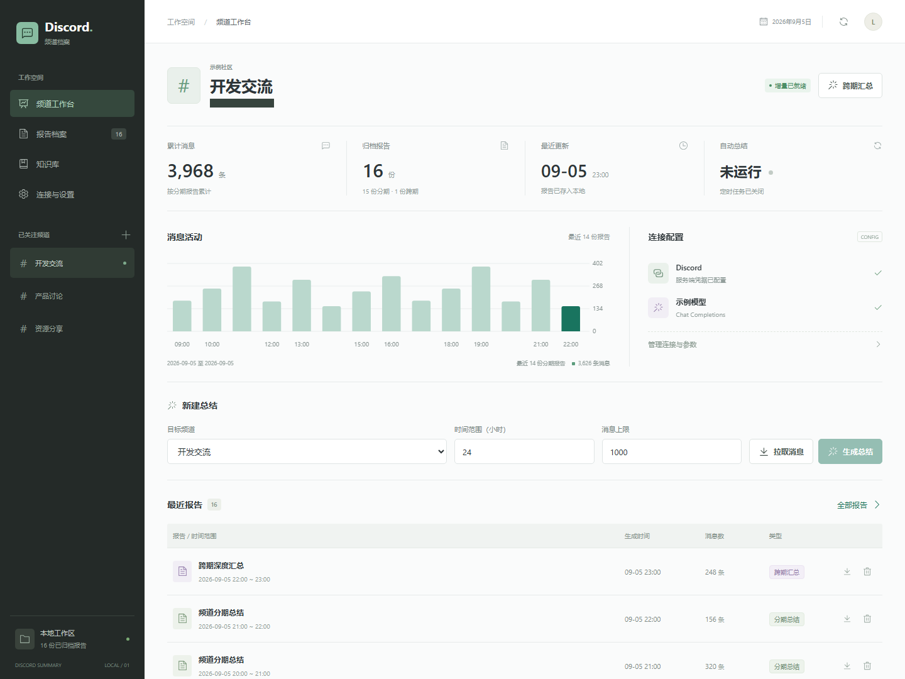
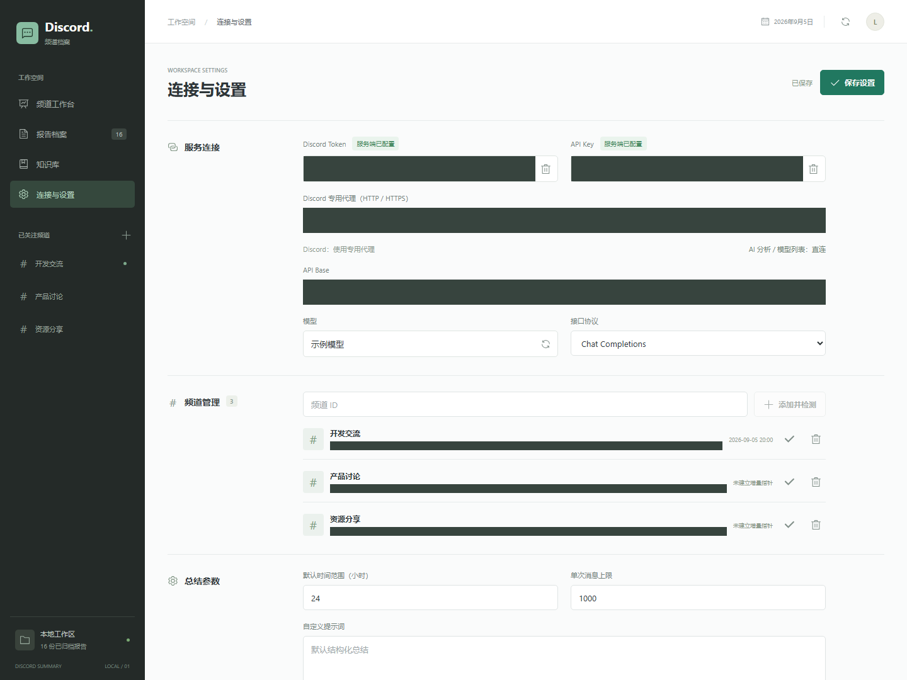

# Discord Summary · 频道总结工作台

一个在本机运行的 Discord 频道总结工具：拉取消息、生成 AI 总结、增量追踪、跨期汇总，再把有价值的内容整理成 Markdown 知识库。

**Python 标准库后端 + Vue 3 前端，无需数据库。**

## 界面预览

> 以下截图全部使用演示数据。频道 ID、接口地址和凭据区域已使用实心遮挡，不包含真实聊天记录或账号信息。

### 频道工作台



### 连接与设置



## 主要功能

- **多频道管理**：添加、检测、切换频道，保留各自的增量指针。
- **手动总结**：按时间范围和消息上限拉取记录，预览后再生成总结。
- **增量总结**：优先处理最早的未处理消息，成功保存报告后再推进指针。
- **跨期汇总**：合并分期报告，记录已处理来源；没有新报告时不重复调用模型。
- **定时任务**：按设定间隔处理已关注频道，与手动任务共用互斥锁。
- **报告档案**：按频道、日期、类型筛选，支持分页、阅读、复制和下载。
- **Markdown 知识库**：生成目录、时间线与频道页面，可直接浏览或交给 Markdown 工具管理。
- **代理隔离**：Discord 可配置专用 HTTP(S) 代理；AI 分析与模型列表始终直连。
- **响应式布局**：支持桌面和手机尺寸，手机端优先呈现总结操作。

## 快速开始

### 环境

- Python 3.12 或更高版本
- Node.js 22 或更高版本
- npm

### 安装并启动

在项目根目录执行：

```bash
cd frontend
npm ci
npm run build
cd ..
python server.py --no-scheduler
```

打开 **http://127.0.0.1:8790**。

首次启动不带个人配置，在「连接与设置」中填写连接信息并保存即可。也可以参考 [`config.example.json`](config.example.json) 创建自己的 `config.json`。

### 使用流程

1. 配置 Discord 凭据、模型接口、模型名称及接口协议。
2. 添加你有权访问的频道，执行「添加并检测」。
3. 在工作台选择频道、时间范围和消息上限。
4. 点击「拉取消息」，检查预览，再点击「生成总结」。
5. 报告会保存到本地，也可以继续做跨期汇总或重建知识库。

## 代理设置

在设置页的「Discord 专用代理」中填写地址，例如：

```text
http://127.0.0.1:7890
```

- 填写后，Discord 消息拉取和频道检测使用该代理。
- 留空时 Discord 直连。
- AI 分析和模型列表不使用该代理，也不读取环境变量或系统 HTTP 代理设置。
- 当前支持带端口的 HTTP(S) 代理地址，不支持 SOCKS5 或包含用户名、密码的代理 URL。
- 系统级 VPN、TUN 或网络网关的路由不属于应用层代理设置。

## 定时任务

`--no-scheduler` 会关闭**当前进程**的后台调度线程，不受已保存开关影响；手动执行仍可使用。

需要自动运行时，先在设置中保存定时参数，再不带该参数启动：

```bash
python server.py
```

更换端口：

```bash
python server.py --port 8791 --no-scheduler
```

同一份配置和历史目录请只运行一个后端进程。

## 模型接口

支持两种兼容协议：

| 协议 | 请求端点 |
| --- | --- |
| Chat Completions | `API Base/chat/completions` |
| Responses | `API Base/responses` |

模型列表从 `API Base/models` 获取，也可以直接填写模型名称。

网页端单次模型输入上限为 **120,000 字符**，不是 token 数。超出时会返回错误，请缩小拉取范围或消息上限；目前没有自动分块总结。

## 本地数据

| 路径 | 用途 | 是否随开源仓库提供 |
| --- | --- | --- |
| `config.example.json` | 无敏感值的配置示例 | 是 |
| `config.json` | 个人配置及凭据 | 否 |
| `schedule_state.json` | 消息指针、汇总来源记录 | 否 |
| `history/` | 个人总结报告与知识库 | 否 |
| `frontend/dist/` | 前端构建产物 | 否 |

配置和状态采用原子写入。报告按类型区分分期总结与跨期汇总，跨期报告不会再次计入原始消息统计。

## 隐私与安全

- 服务仅监听本机回环地址，并拒绝非本地来源的浏览器请求；**不适合直接暴露到公网**。
- 配置读取接口仅返回凭据是否存在，不返回已保存的凭据。
- 普通设置保存不会覆盖未填写的凭据；移除凭据需要单独确认。
- 当前凭据仍保存在本机 `config.json` 中，**尚未接入加密凭据库**，请保护文件和设备访问权限。
- Markdown 不执行原始 HTML；远程图片显示为链接，阅读时不会自动加载。
- 聊天内容会发送到你配置的模型服务。请确认频道授权、数据隐私要求、模型服务的计费及数据处理规则。
- 请遵守 Discord 的平台规则，仅处理你有权访问和使用的内容。
- `.gitignore` 已排除配置、历史记录、环境文件、日志与常见凭据文件。不要强制提交这些文件。

## 前端开发

先启动 Python 后端，再执行：

```bash
cd frontend
npm run dev
```

Vite 默认将 `/api` 转发到 `http://127.0.0.1:8790`。需要使用其他后端地址时，可以设置 `SUMMARY_BACKEND_URL` 环境变量。

## 项目结构

```text
.
├── server.py                 # 本地 HTTP 服务、消息拉取、总结与调度
├── discord_summary.py        # 独立命令行入口
├── config.example.json       # 无敏感值的配置示例
├── frontend/
│   └── src/
│       ├── components/       # 设置、图表、报告列表与阅读器
│       ├── composables/      # 工作区状态与操作
│       └── lib/              # API 与数据处理工具
└── docs/images/              # 使用演示数据制作的打码介绍图
```

## 开源许可

采用 [MIT License](LICENSE)。第三方依赖遵循各自的许可证。
